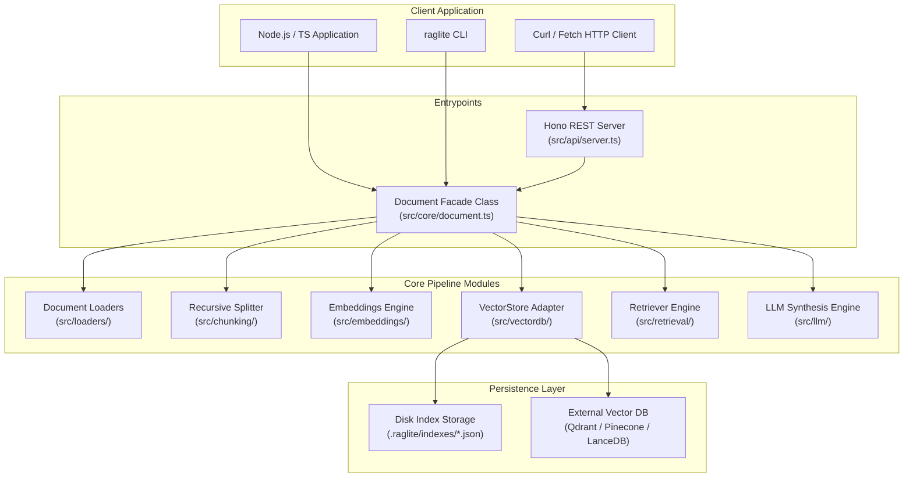

# RAGLite TypeScript (`raglite-toolkit`) Architecture

This document details the software architecture, component design, data flow, and APIs of the TypeScript implementation of **RAGLite** (`raglite-toolkit`).

---

## 1. Overview & Core Philosophy

`raglite-toolkit` is an ESM-first, TypeScript-native Retrieval-Augmented Generation library. It provides zero-boilerplate semantic search, multi-provider LLM response synthesis, and a self-hosted Hono REST server over local files.

### Key Characteristics
* **TypeScript-First & Strict Types**: Full type safety for all configs, vectors, chunks, search results, and API schemas.
* **Pluggable & Extensible**: Interfaces for Document Loaders, Splitters, Embeddings, Vector Stores, and LLMs.
* **Per-Document Isolation**: Namespaced vector collections tied to source document path/identity.
* **SHA-256 Content Caching**: Automatically skips re-embedding if document content has not changed.
* **Offline-First Option**: Local offline embeddings via `@huggingface/transformers` (`Xenova/all-MiniLM-L6-v2`) and local LLMs via Ollama.

---

## 2. Directory & Module Structure

```
raglite/src/
├── api/             # REST HTTP server (Hono) & endpoint schemas
│   ├── index.ts
│   ├── schemas.ts
│   └── server.ts
├── chunking/        # Text splitting algorithms
│   ├── base.ts
│   ├── index.ts
│   └── recursive.ts
├── core/            # Main facade orchestrator
│   └── document.ts
├── embeddings/      # Embedding provider factory & adapters
│   ├── base.ts
│   ├── factory.ts
│   ├── index.ts
│   ├── local.ts      # @huggingface/transformers (ONNX)
│   ├── models.ts
│   └── remote.ts     # OpenAI, Gemini, Mistral, Cohere, Voyage, Ollama
├── llm/             # LLM provider factory & prompt synthesis
│   ├── answer.ts
│   ├── factory.ts
│   ├── index.ts
│   ├── models.ts
│   └── prompt.ts
├── loaders/         # Document parser implementations
│   ├── base.ts
│   ├── docx.ts       # Mammoth reader
│   ├── index.ts
│   ├── json.ts
│   ├── markdown.ts
│   ├── pdf.ts        # pdf-parse reader
│   └── txt.ts
├── retrieval/       # Retriever & ranking algorithms
│   ├── index.ts
│   └── retriever.ts
├── vectordb/        # Vector Database adapters
│   ├── base.ts       # VectorStore interface
│   ├── factory.ts
│   ├── lancedb.ts    # Embedded LanceDB
│   ├── memory.ts     # Local JSON persistence (.raglite/)
│   ├── pinecone.ts   # Pinecone Cloud
│   └── qdrant.ts     # Qdrant local/cloud
├── cli.ts           # Command-line interface tool
├── config.ts        # Environment & default configuration
├── constants.ts     # System constants & defaults
├── errors.ts        # Custom RAGLite error definitions
├── index.ts         # Module entrypoint & public exports
├── types.ts         # TypeScript interfaces & types
└── utils/           # Utility functions (hashing, math, crypto)
```

---

## 3. High-Level System Diagram



---

## 4. End-to-End Data Pipeline

### 4.1 Ingestion & Indexing
1. `doc.build()` invokes the appropriate `DocumentLoader` based on file extension (`.pdf`, `.txt`, `.json`, `.md`, `.docx`).
2. Calculates SHA-256 hash of raw document content.
3. Checks existing `IndexMetadata` in `VectorStore`. If hash matches, skips re-indexing.
4. If hash differs or force rebuild requested:
   - `RecursiveCharacterTextSplitter` chunks text (default size 1000, overlap 200).
   - `EmbeddingFactory` generates normalized vectors for each chunk.
   - `VectorStore.add()` saves chunks and `VectorStore.saveIndexMetadata()` persists index metadata.

### 4.2 Retrieval & Answer Synthesis
1. `doc.search(query, topK)`:
   - Embeds query text.
   - Executes vector search via `VectorStore.search()`, calculating cosine similarity over L2-normalized vectors.
   - Returns top $K$ `SearchResult` objects.
2. `doc.ask(question, options)`:
   - Runs `search(question)`.
   - Constructs context-augmented system/user prompt via `buildPrompt()`.
   - Calls `generateAnswer()` or `streamAnswer()` with selected LLM adapter (OpenAI, Anthropic, Google, Groq, Ollama, etc.).

---

## 5. REST API Architecture

Built using **Hono** framework for high performance and lightweight execution.

| Method | Endpoint | Auth Required? | Description |
| :--- | :--- | :--- | :--- |
| `GET` | `/health` | No | Liveness status & total chunk count |
| `GET` | `/info` | Yes (Bearer token) | Configuration details & index state |
| `POST` | `/search` | Yes (Bearer token) | Semantic vector search |
| `POST` | `/ask` | Yes (Bearer token) | Context Q&A generation (supports streaming) |

---

## 6. Vector Database Adapter Contract (`src/vectordb/base.ts`)

```ts
export interface VectorStore {
  load(docId: string): Promise<void>;
  reset(docId: string): Promise<void>;
  add(docId: string, chunks: StoredChunk[]): Promise<void>;
  search(docId: string, queryVector: number[], topK: number, minScore?: number): Promise<SearchResult[]>;
  count(docId: string): Promise<number>;
  saveIndexMetadata(docId: string, meta: IndexMetadata): Promise<void>;
  readIndexMetadata(docId: string): Promise<IndexMetadata | null>;
}
```
